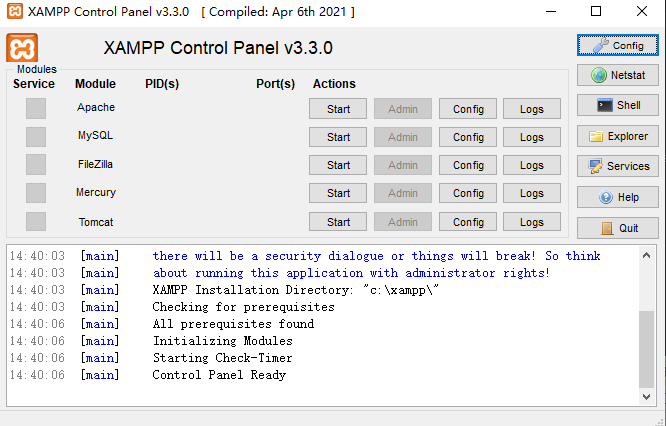
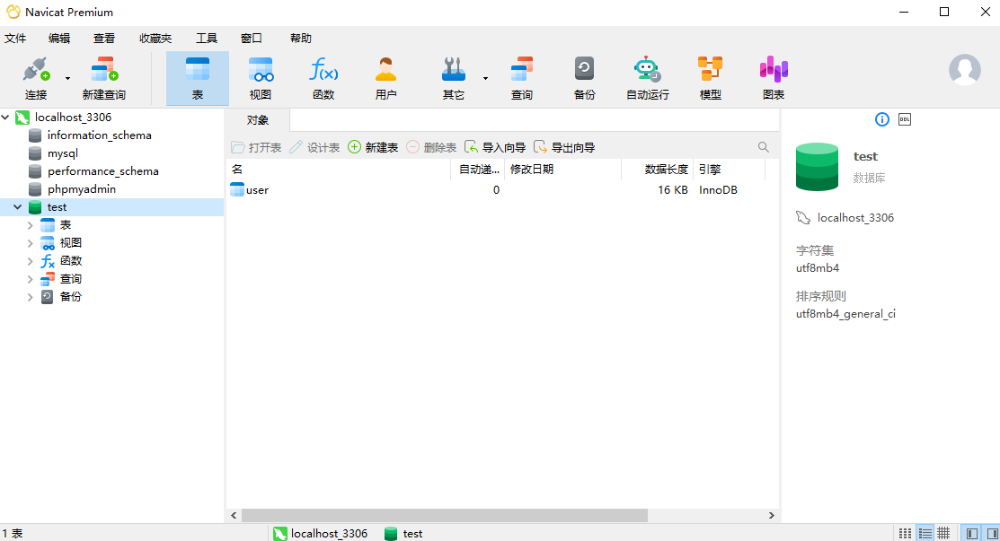
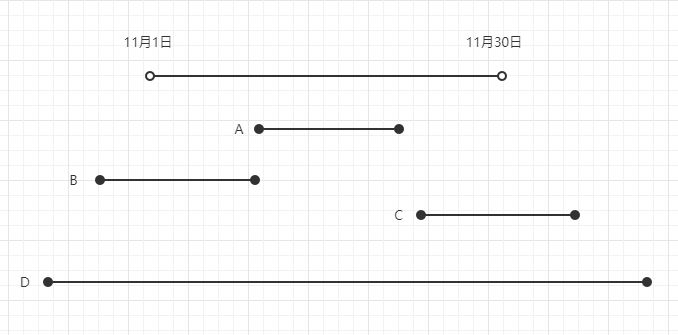

= SQL =

SQL (Structured Query Language) 是用于与大多数数据库系统交流的标准语言，包括数据插入、查询、更新和删除，数据库模式创建和修改，以及数据访问控制。人类语言的语法中，离不开主谓宾定装补这样的语法，想象自己与数据库交流，让数据库根据我们的命令做一些事情，这就是SQL语句。

在学习SQL之前必须先了解数据库中的一些最基础的内容

== 一、数据库简介 ==


TIP: 这里说的数据库都是关系型数据库

=== 1. 环境搭建 ===

只是学习使用不推荐直接去部署数据库，太麻烦还要解决一系列依赖问题，下载xampp或phpstudy这样的一键部署的集成环境即可。除此之外还要下载一个数据库管理工具Navicat。安装基本上都是一直点确定下一步即可，非常简单。







=== 2. 表 ===

表是数据库中最重要的元素。在表中行和列的逻辑顺序无关紧要，每个表至少包含一列，该列被称为**[.red]##主键##**，它唯一的表示了表中的每一行。

=== 3. 字段（列） ===

字段是数据库中最小的元素，表示其所属的表的一个特征。

字段是用于存储数据的元素，并且字段中的数据是可检索的。在设计合理的数据库中每一字段都只包含一个值，且字段名应指出这个值的类型。

=== 4. 行 ===

表中的每一行都表示一个*独一无二*的客体，它包含表中的所有字段，不管这些字段是否包含值。

=== 5. 键 ===
   
键是表中扮演特殊角色的字段。键的类型决定了它在表中扮演什么角色，这里只讨论两种键：主键和外键。
    
**[.red]##主键##**由一字段或多字段组成，唯一的标识了表中的每一行，主键由多字段组成时称为联合主键

.表名：users
[width="60%", options="header]
|======================
|user_id  |user_name |user_age
|1        |apple     |19
|2        |banana    |25
|3        |car       |30
|4        |apple     |25
|======================


如图所示一张表，3个字段10行，3个字段的字段名分别为user_id、user_name、user_age，主键为user_id，这是因为user_id唯一的标识了表中的每一行。

当有两个或两个以上表时，一些表之间彼此相关，为了建立两张表之间的关系，通常复制第一个表的主键，并将其插入到第二个表中，这个主键就被称为**[.red]##外键##**。

TIP: 第二个表有自己的主键，引入的第一个表的主键只是为了建立两张表之间的关系才引入到第二张表里的，就算不引入外键，第二个表也是具备完整性的，除非你引入外键做第二个表的联合主键使用。

=== 6. 数据类型 ===


[width="80%" cols=",,,"]
|======================
|整型（整数）         |INT       2+|4个字节 -2147483648~2147483647
|浮点型（小数）       |FLOAT     2+|单精度浮点型4字节8位精度
|浮点型       |DOUBLE    2+|双精度浮点型8字节16位精度
|字符串类型   |CHAR      2+|固定长度，最多255个字符
|字符串类型   |VARCHAR   2+|固定长度，最多65535个字符
|日期类型     |DateTime  2+|日期时间 如：‘2008-12-2 22:06:44’
|日期类型     |TimeStamp 2+|自动存储记录修改时间格式和Datatime相同 
|======================


=== 7. 数据库三大范式 ===
   
第一范式：遵循原子性。即表中字段的数据，不可以再拆分。
   
第二范式：在满足第一范式的情况下，遵循唯一性，消除部分依赖。即表中任意一个主键或任意一组联合主键，可以确定除该主键外的所有的非主键值。

第三范式：在满足第二范式的情况下，消除传递依赖。即在任一主键都可以确定所有非主键字段值的情况下，不能存在某非主键字段 A 可以获取某非主键字段 B。通俗点讲就是：一张表能且只能描述一件事情。

只有当三大范式都满足的情况下才算是合格的数据库表


== 二、SQL基础 ==

在逻辑层面上讲，比起增删改，查无疑是最重要也最复杂的一部分，所以这里先写关于查询的内容。


=== 1. 创建简单查询 select和from ===
   
   
select语句是一切查询问题的基石，创建并执行select语句时就是在查询数据库
```
select 字段名 from 表名
```

select和from是select语句中必不可少的部分，select用来指定在查询集合中包含哪些字段而这些字段来自哪张表是由from决定的。

如果要查询多个字段使用以下sql语句：
```
select 字段名, 字段名, ……  from 表名
```


如果要查询所有字段可以在select后把所有字段名都写上，当然更简单的方法直接使用以下sql语句：
```
select * from 表名
```

以此表为例：

.表名：users
[width="60%", options="header"]
|======================
|user_id  |user_name |user_age
|1        |apple     |19
|2        |banana    |25
|3        |car       |25
|4        |apple     |30
|======================
```
select user_name from users
```
结果为：
[width="20%", options="header"]
|======================
|user_name 
|apple     
|banana    
|car       
|apple     
|======================


=== 2.筛选数据 where ===

where这个子句是可选的，用于筛选的作用，语法为：
[,sql]
----
select 字段名 from 表名 where 查找条件
----
关于查找条件要怎么写，常见的有以下5种方式：比较匹配、范围匹配、成员匹配、模式匹配、NULL匹配，除此之外还有三种逻辑关系与’and‘、或’or‘、非’not‘来组合这些匹配方式。

==== 2.1 比较 ====

[,sql]
----
select 字段名 from 表名 where 值表达式 比较 值表达式 
----


比较中可以写
[width="60%"]
|======================
|=        |等于     
|<        |小于    
|>        |大于      
|\<=      |小于等于     
|>=       |大于等于     
|<>       |不等于     
|======================

TIP: 不同版本的数据库也有用 “!=” 来表示不等于，具体要看数据库系统文档来确定   

以此表为例：

.表名：users 
[width="60%", options="header"]
|======================
|user_id  |user_name |user_age
|1        |apple     |19
|2        |banana    |25
|3        |car       |25
|4        |apple     |30
|======================
[,sql]
----
select user_name from users where user_id = 3
----

[width="20%", options="header"]
|======================
|user_name 
|car    
|======================

[,sql]
----
select user_name from users where user_name = 'apple'
----

[width="20%", options="header"]
|======================
|user_name 
|apple    
|apple    
|======================


[TIP] 
====
关于字符串的比较大小写敏感，而且必须要使用英文的引号，前为单引号后面一定也要为单引号，前为双引号后面一定也要为双引号，推荐使用单引号，这是因为在很多场景下SQL语句也为字符串，且大多数时候都用双引号来表示字符串，如果SQL语句中使用了双引号则
```
"select user_name from users where user_name = "apple""
``` 
只会识别到
```
select user_name from users where user_name = 
```
就结束了，这样数据库就会报错。当然也不排除有的人用单引号来表示字符串，这个时候我们就反过来在SQL语句中用双引号。
====


==== 2.2 范围 between ====
使用范围条件可检查表达式值是否在特定的范围内，使用between……and……，这种语法为：

[,sql]
----
select 字段名 from 表名 where 值表达式 between 值表达式 and 值表达式
----

以此表为例：

.表名：users
[width="60%", options="header"]
|======================
|user_id  |user_name |user_age
|1        |apple     |19
|2        |banana    |25
|3        |car       |25
|4        |apple     |30
|======================

[,sql]
----
select user_name from users where user_age between 20 and 40
----

[width="20%", options="header"]
|======================
|user_name 
|banana    
|car       
|apple     
|======================

当然你也可以直接写
[,sql]
----
select user_name from users where user_age >= 20 and user_age <= 40
----

[TIP]
====
使用between时有一点要注意前面的值一定要小于后面的值，between为“且”逻辑，使用
[,sql]
----
select user_name from users where user_age between 40 and 20
----
这样的语句等价于
[,sql]
----
select user_name from users where user_age >=40 and user_age <= 20
----
虽然不会报错，但是什么结果都查不到，因为在表users中不会有user_age大于40且小于20的数据。
====

==== 2.3 成员 in ====
要检查一个值表达式的值是否为一个系列中的一个，可使用成员资格条件，使用in来判断，语法为：

[,sql]
----
select 字段名 from 表名 where 值表达式 in (值表达式, ……)
----

以此表为例：

.表名：users
[width="60%", options="header"]
|======================
|user_id  |user_name |user_age
|1        |apple     |19
|2        |banana    |25
|3        |car       |25
|4        |apple     |30
|======================
[,sql]
----
select * from users where user_name in ('apple', 'banana')
----

[width="60%", options="header"]
|======================
|user_id  |user_name |user_age
|1        |apple     |19
|2        |banana    |25
|4        |apple     |30
|======================
当然你也可以直接写
[,sql]
----
select user_name from users where user_name = 'apple' or user_name = 'banana' 
----
从这里也可以体会到in为“或”的逻辑。

==== 2.4 模式 like escape ====

需要找出类似于给定模式的值，或将部分信息作为查找条件时，这种模糊的匹配称为模式匹配。语法为：

[,sql]
----
select 字段名 from 表名 where 值表达式 like 模式字符串
----
模式字符串可包含任何常规字符和两个特殊的通配字符——百分号‘%’ 和 下划线‘_’，百分号字符表示任意数量（包括零个）的常规字符，下划线表示单个常规字符。下面给出一些列子：

[width="60%", options="header"]
|======================
|模式字符串用例  |意义 
|ap%          |以"ap"开头的任意长度字符串 
|%le          |以"le"结尾的任意长度字符串  
|%ppl%          |包含"ppl"的任意字符串，且"ppl"可以在字符串的开头和结尾
|appl_        |以appl开头且包含5个字符的字符串
|_pple        |以pple结尾且包含5个字符的字符串
|\_ppl_        |包含5个字符且中间3个字符为"ppl"的任意字符串
|_pp%        |第2、3个字符为"pp"的任意字符串
|%pl_        |倒数第3、2个字符为"pl"的任意字符串
|======================

TIP: Access数据库使用星号‘*’和问号‘？’来代替‘%’和‘_’。


以此表为例：

.表名：users
[width="60%", options="header"]
|======================
|user_id  |user_name |user_age
|1        |apple     |19
|2        |banana    |25
|3        |car       |25
|4        |pineapple |30
|5        |_anana    |35
|6        |cat       |5
|======================
[,sql]
----
select * from users where user_name like '%apple'
----

[width="60%", options="header"]
|======================
|user_id  |user_name |user_age
|1        |apple     |19
|4        |pineapple |30
|======================

[,sql]
----
select * from users where user_name like 'ca_'
----
[width="60%", options="header"]
|======================
|user_id  |user_name |user_age
|3        |car       |25
|6        |cat       |5
|======================


虽然合适的通配字符能查找任何模式的字符串，但是如果要检索的数据值中本身就存在百分号‘%’ 或 下划线‘_’就会出现麻烦，以users表中的数据"_anana"为例，我们如果使用以下SQL语句查询就会出现问题：
[,sql]
----
select * from users where user_name like '_anan_'
----
[width="60%", options="header"]
|======================
|user_id  |user_name |user_age
|2        |banana    |25
|5        |_anana    |35
|======================
本来只想查询"_anana"这条数据结果把“banana”也一起查了出来，因此为了解决这种问题，模式匹配也有语法为：

[,sql]
----
select 字段名 from 表名 where 值表达式 like 模式字符串 escape 字符串字面量
----

escape让你能够指定转义字符，SQL语句中如果通配字符前面是转义字符，数据库系统将把它转化为实际字符。
以此表为例：

.表名：users
[width="60%", options="header"]
|======================
|user_id  |user_name |user_age
|1        |apple     |19
|2        |banana    |25
|3        |car       |25
|4        |pineapple |30
|5        |_anana    |35
|6        |cat       |5
|======================
[,sql]
----
select * from users where user_name like '|_anan_' escape '|'
----
[width="60%", options="header"]
|======================
|user_id  |user_name |user_age
|5        |_anana    |35
|======================

[TIP] 
====
escape的内容可以任意，只要保证前后一致且和你想匹配的数据不相关即可。如：
[,sql]
----
select * from users where user_name like '@_anan_' escape '@'
----
也是可以的。
许多新版本的数据库已经可以使用反斜杠’\‘直接作为转义字符，所以上面的SQL语句可以直接写为:
[,sql]
----
select * from users where user_name like '\_anan_'
----
但是此时千万不能写
[,sql]
----
select * from users where user_name like '\_anan_' escape '\'
----
因为后面一个反斜杠自身也带转义效果，正确的写法为：
[,sql]
----
select * from users where user_name like '\_anan_' escape '\\'
----
====

==== 2.5 空 null ====

处理数据库难免会遇到数据缺失或未知，这些内容在特定的情况下也是有意义的，要查询这些数据语法为：
[,sql]
----
select 字段名 from 表名 where 值表达式 is null
----
以此表为例：

.表名：users
[width="60%", options="header"]
|======================
|user_id  |user_name |user_age
|1        |apple     |19
|2        |banana    |25
|3        |(null)    |25
|4        |pineapple |30
|5        |(只有空格) |35
|6        |cat       |5
|======================
[,sql]
----
select * from users where user_name is null
----
[width="60%", options="header"]
|======================
|user_id  |user_name |user_age
|3        |(null)    |25
|======================


如果数据只包含空格这样看上去是null的数据该怎么查呢？
[,sql]
----
select * from users where user_name = "(这里可以是任意数量的空格)"
----
[width="60%", options="header"]
|======================
|user_id  |user_name |user_age
|5        |(只有空格) |35
|======================

[TIP]
====
必须使用is null来查询，不能使用 = null，如果要查询非空数据就使用is not null，不能使用 <> null，between、in语句不会对null进行过滤匹配，这是因为**[.red]##null不能参与比较运算符##**，即与任何数据比较结果都为null。 NULL查询在不同版本数据库有许多不同的效果，有的数据库使用is null也能把只含空格的数据查出来。有的数据库要求也比较严格，只包含空格的数据也必须要输入正确的空格数量才能查到。
====


==== 2.6 与或非 and or not ====
使用多个查询条件时使用 and 和 or来连接，and表示且逻辑，or表示或逻辑，如果想要排除查询条件外的数据就使用not，三种逻辑可以混合使用来处理较为复杂的查询，这些具体的例子在上面也出现过就不再赘述，只给出语法：
[,sql]
----
select 字段名 from 表名 where 查找条件 and 查找条件 …… 
select 字段名 from 表名 where 查找条件 or 查找条件 …… 
select 字段名 from 表名 where not 查找条件
----
逻辑上存在一个优先级问题，
[width="90%", options="header"]
|======================
|优先级 | 运算符 |
|1 最高 | 括号 |“( )”
|2     | 算数运算符 |“ * / + - ” 
|3     | 查找条件符号和关键字 |“ = < > \<= >= between in like  is null”
|4     | 非 | not
|5     | 与 | and 
|6     | 或 | or
|======================


=== 3. 优化查询 ===

当SQL语句特别长特别复杂时，想看查找条件之间的查找顺序就很难了，但还好有括号这种能够强制改变查找条件优先级的运算符，因此为了程序的可读性（哪怕本意不是为了改变查找顺序），用括号把查找条件顺序明确的标识出来，这样就从复杂的优先级关系中解脱，直接看括号安排的顺序就行。

当数据库数据量特别大，还不得不面临一个效率的问题，一个好的SQL语句会让查询速度更快。如何提高查询速度首先就是不要要求太多，写SQL语句前应先优化逻辑，只选择能够满足请求的字段，并让查找条件尽可能的具体，从而让数据库处理的行数越少，运行速度自然也就越快。当然一切的前提都是要写对SQL语句。

举一个例子：有一张关于服务器开关机时间的表，现在我想从这张表中查找11月到12月之间运行过的服务器有哪些。
根据直觉我们可以写出这样的SQL语句来：
[,sql]
----
select * from 表名 where 开机时间 >= 11月1日 and  关机时间 <= 11月30日 
----

如果这样写显然是错的，注意我们问的是11月到12月之间++运行过++的服务器，真实的情况是这样的：




有些服务器运行时间完全在11月内，如线条A所示，有些服务器在11月之前就开机了但在11月中关机，如线条B所示，有些服务器在11月中才开机但在11月后关机，如线条C所示，有些服务器在11月前开机但在11月后才关机，如线条D所示。上面那条sql语句只能查到线条A这种情况，但是要求的却是ABCD这4种都要查到，那么我们开始写正确的SQL语句：
[,sql]
----
select * from 表名 
where (开机时间 >= 11月1日 and  关机时间 <= 11月30日)
or (开机时间 < 11月1日 and  关机时间 >= 11月1日 and 关机时间 <= 11月30日)
or (开机时间 >= 11月1日 and 开机时间 <= 11月30日 and 关机时间 > 11月30日)
or (开机时间 < 11月1日 and 关机时间 > 11月30日) 
----
这样就完全覆盖了ABCD四种情况了，但是也可以看到这个SQL有多长了，如果不是通过换行和加括号的方法很难看懂它到底查了个什么东西。不但我们看着不舒服，数据库在处理这么多要求时也让它不得不重复遍历同一张表，效率极其低下。所以这个时候就从逻辑角度来优化这条SQL语句。再回到我们的问题，注意我们问的是++11月到12月之间运行过++的服务器，换言之只需要排除11月之前就关机的和12月之后才开机的服务器就可以了：
[,sql]
----
select * from 表名 
where not (开机时间 > 11月30日 or 关机时间 < 11月1日)
----
如果觉得有not和括号还是不够简洁，根据逻辑的反演律（非（A或B）等价于 非A且非B）可以这样写:
[,sql]
----
select * from 表名 where 开机时间 <= 11月30日 and 关机时间 >= 11月1日
----


== 三、使用多个表 ==

=== 1. 简单多表查询 ===
直接看语法：
[,sql]
----
select 字段名1, 字段名2, …… from 表名1, 表名2, ……
----
直接看例子：

.表名：教师 
[width="40%", options="header"]
|======================
|教师编号  |教师名
|1001      |张sir  
|1002      |王sir 
|======================

.表名：课程 
[width="60%", options="header"]
|======================
|课程号   |课程名    |教师编号
|1        |数学     |1001
|2        |语文     |1002
|======================


根据这两张表查询教师们教的课程有哪些：

[,sql]
----
select 课程名, 教师名 from 课程, 教师
----
结果为：
[width="40%", options="header"]
|======================
|课程名    |教师名
|数学      |张sir
|语文      |张sir
|数学      |王sir
|语文      |王sir
|======================
明明张sir只教了数学，而王sir只教了语文，却得出了这种诡异的结果。实际上这是因为数据库的底层逻辑就是集合论，而造成上面这种结果的原因就是集合论中的笛卡尔积。两个集合X和Y的笛卡尓积，第一个对象是X的成员而第二个对象是Y的所有可能有序对的其中一个成员。

假设集合A={a, b}有两个元素，集合B={0, 1, 2}有三个元素，则两个集合的笛卡尔积为{(a, 0), (a, 1), (a, 2), (b, 0), (b, 1), (b, 2)}有2*3为6个元素。

出现上面这种情况，为了体现数据的完整性，数据库将结果直接以笛卡尔积的形式呈现了，现在只要加上合适的查找条件过滤掉没用的数据就行了，提到查找条件之前学到的where就又要登场了，但在解决这个问题前先介绍另一个要点：

==== 1.1 字段引用 ====
在对单个表时无需关心字段的问题，但多张表难免会出现字段名相同的情况。还是这个例子：

.表名：教师 
[width="40%", options="header"]
|======================
|教师编号  |教师名
|1001      |张sir  
|1002      |王sir 
|======================

.表名：课程 
[width="60%", options="header"]
|======================
|课程号   |课程名    |教师编号
|1        |数学     |1001
|2        |语文     |1002
|======================


两张表都有教师编号这样一个字段，所以为了区别教师编号来自于哪个表，在字段名前加上表名：
[,sql]
----
select 表名1.字段名1, 表名2.字段名2, …… from 表名1, 表名2, ……
----

在回到刚才的问题，现在可以这样写了：
[,sql]
----
select 课程.课程名, 教师.教师名 
from 课程, 教师 
where 课程.教师编号 = 教师.教师编号
----
[width="40%", options="header"]
|======================
|课程名    |教师名
|数学      |张sir
|语文      |王sir
|======================

==== 1.2 别名 ====
创建SQL语句时，如果表的名称特别长，我们也可以给他起一个简短的名字方便使用
[,sql]
[,sql]
----
select 别名.字段名 from 表名 as 别名
----
还是刚刚那个问题，现在可以改为：
[,sql]
----
select c.课程名, t.教师名 
from 课程 as c, 教师 as t 
where c.教师编号 = t.教师编号
----

=== 2. 内连接 ===
之前我们说了数据库的底层逻辑就是集合论，内连接就是一种交集运算。语法为：
[,sql]
----
select 字段名1，字段名2 from 表名1 inner join 表名2 on 查找条件
----

直接看例子：

.表名：教师 
[width="40%", options="header"]
|======================
|教师编号  |教师名
|1001      |张sir  
|1002      |王sir 
|======================

.表名：课程 
[width="60%", options="header"]
|======================
|课程号   |课程名    |教师编号
|1        |数学     |1001
|2        |语文     |1002
|======================

[,sql]
----
select 课程.课程名, 教师.教师名 
from 课程 
inner join 教师 
on 课程.教师编号 = 教师.教师编号
----
结果为：
[width="40%", options="header"]
|======================
|课程名    |教师名
|数学      |张sir
|语文      |王sir
|======================

这时候不免有一个疑问，使用内连接查询到的数据和上面直接使用where时一模一样，那为什么不直接使用where呢？理由后面讲到外连接时就知道了。

理论上可以连接无数张表，甚至可以和同一张表反复连接：
[,sql]
----
select 字段名1，字段名2，…… 
from 表名1 
inner join 表名2 on 查找条件
inner join 表名3 on 查找条件
……
----
举个例子：

.表名：登录事件 
[width="40%"]
|======================
|登录日期   |用户id
|1         |1001
|2         |1001
|3         |3003
|4         |1001
|5         |1001
|6         |1001
|7         |2002
|8         |2002
|9         |2002
|======================

现在要查找所有连续三天登录的用户id

使用where：
[,sql]
----
select a.用户id
from 登录事件 as a, 登录事件 as b, 登录事件 as c
where a.登录日期+1 = b.登录日期 and a.登录日期+2 = c.登录日期
and a.用户id = b.用户id and a.用户id = c.用户id
----

使用内连接：

[,sql]
----
select a.用户id
from 登录事件 as a
inner join 登录事件 as b 
on (a.登录日期+1 = b.登录日期 and a.用户id = b.用户id)
inner join  登录事件 as c 
on (a.登录日期+2 = c.登录日期 and a.用户id = c.用户id)
----
on 和 where也可以混合用：
[,sql]
----
select a.用户id
from 登录事件 as a
(inner join 登录事件 as b on a.登录日期+1 = b.登录日期)
(inner join  登录事件 as c on a.登录日期+2 = c.登录日期)
where a.用户id = b.用户id and a.用户id = c.用户id
----

[width="20%"]
|======================
|用户id
|1001
|2002
|======================

=== 3. 外连接 ===
内连接只返回指定的准则匹配的行，但是现实情况下有的数据只满足部分匹配却依然还需要被查询到，用内连接就无法完成这样的工作，举个例子：

.表名：教师 
[width="40%", options="header"]
|======================
|教师编号  |教师名
|1001      |张sir  
|1002      |王sir 
|1003      |李sir
|1004      |刘sir 
|======================

.表名：课程 
[width="60%", options="header"]
|======================
|课程号   |课程名    |教师编号
|1        |数学     |1001
|2        |语文     |1002
|3        |物理     |1003
|4        |政治     |1003
|5        |英语     |(null)
|======================
现在要查询所有老师和所有课程的教学任务，使用内连接：
[,sql]
----
select 课程.课程名, 教师.教师名 
from 课程 
inner join 教师 
on 课程.教师编号 = 教师.教师编号
----
[width="60%", options="header"]
|======================
|课程名    |教师名
|数学     |张sir
|语文     |王sir 
|物理     |李sir
|政治     |李sir 
|======================
我们可以看到，刘sir在学校里没教任何课，英语课也没有任何一个教师来教，这导致这两数据无法被查到。那么这个时候就要使用外连接，外连接可以获取一个表或集合中的所有行或匹配的行以及另一张表或集合的所有行或匹配的行，简单来说就是可以查找缺失值和部分匹配的数据，语法为：
[,sql]
----
select 字段名1，字段名2 
from 表名1 left join 表名2 
on 查找条件
----
其中left可以换为right和full，分别表示左外连接、右外连接和全外连接，先看左外连接：
[,sql]
----
select 课程.课程名, 教师.教师名 
from 课程 
left join 教师 
on 课程.教师编号 = 教师.教师编号
----
[width="60%", options="header"]
|======================
|课程名    |教师名
|数学     |张sir
|语文     |王sir 
|物理     |李sir
|政治     |李sir 
|英语     |(null)
|======================

右外连接：
[,sql]
----
select 课程.课程名, 教师.教师名 
from 课程 
right join 教师 
on 课程.教师编号 = 教师.教师编号
----
[width="60%", options="header"]
|======================
|课程名    |教师名
|数学     |张sir
|语文     |王sir 
|物理     |李sir
|政治     |李sir 
|(null)   |刘sir
|======================

这里可以看出左、右外连接的区别就在于是以join左边的表为基准还是join右边的表为基准。

全外连接：
[,sql]
----
select 课程.课程名, 教师.教师名 
from 课程 
full join 教师 
on 课程.教师编号 = 教师.教师编号
----
[width="40%", options="header"]
|======================
|课程名    |教师名
|数学     |张sir
|语文     |王sir 
|物理     |李sir
|政治     |李sir 
|(null)   |刘sir
|英语     |(null)
|======================
其实在这里我们就可以看出了，如果单纯的使用where来代替join on，查询结果就会变成内连接那样了。

[TIP]
====
有一点非常讨厌的是，mysql数据库只有企业版才支持全外连接，这个时候只能使用where语句来写了，下面介绍的union语句和子查询会帮助我们解决这个问题
====


=== 4. 并集 union ===

union能够从多个类似的结果集中选择行，并将它们合并为单个结果集，语法为：
[,sql]
----
select语句 union select语句 ……
----
例子：
.表名：教师 
[width="40%", options="header"]
|======================
|教师编号  |教师名
|1001      |张sir  
|1002      |王sir 
|1003      |李sir
|1004      |刘sir 
|======================

.表名：课程 
[width="60%", options="header"]
|======================
|课程号   |课程名    |教师编号
|1        |数学     |1001
|2        |语文     |1002
|3        |物理     |1003
|4        |政治     |1003
|5        |英语     |(null)
|======================

查询所有课程的教学任务，根据上面学到的外连接可以直接写为：

[,sql]
----
select 课程.课程名, 教师.教师名 
from 课程 
left join 教师 
on 课程.教师编号 = 教师.教师编号
----

但如果有的数据库不支持外连接时，我们只能用where来写:
[,sql]
----
select 课程.课程名, 教师.教师名 
from 课程, 教师 
where 课程.教师编号 = 教师.教师编号
union select 课程.课程名, null 
from 课程
where 课程.教师编号 is null
----

[width="40%", options="header"]
|======================
|课程名    |教师名
|数学     |张sir
|语文     |王sir 
|物理     |李sir
|政治     |李sir 
|英语     |(null)
|======================

看到这里可能大家会感到奇怪为什么要这样写，首先先解释
[,sql]
----
union select 课程.课程名, null 
----
这句话，这里的null只是为了起一个占位的作用，这是因为**[.red]##union所连接的两个select必须查询相同的字段数##**，简单来讲就是列数不相同的两张表格是不能合并在一起的，这里如果去掉null就会报错并提示你两个select查询字段数不相等。现在再解释为什么要使用null，而不直接使用和第一个select中一样的“教师.教师名”这个字段呢？我们改掉这句话看看效果：
[,sql]
----
select 课程.课程名, 教师.教师名 
from 课程, 教师 
where 课程.教师编号 = 教师.教师编号
union select 课程.课程名, 教师.教师名
from 课程, 教师 
where 课程.教师编号 is null
----
注意看第二个from这里也改了，因为“教师.教师名”这个字段在“教师”这个表里，不改的话数据库会直接报错，并提示你没有“教师.教师名”这个字段。查询结果为：
[width="40%", options="header"]
|======================
|课程名    |教师名
|数学     |张sir
|语文     |王sir 
|物理     |李sir
|政治     |李sir 
|英语     |张sir
|英语     |王sir 
|英语     |李sir
|英语     |李sir 
|======================
结果显然是错的，前4行是对的它来自第一个select就不多说了，直接看有问题的后4行，“where 课程.教师编号 is null” 这句话只把没人教的英语选出来了，而另一边还要从“教师”这张表选出所有老师来，因为笛卡尔积的缘故，第一张表的每行和第二张表的每行都要做结合，所以才会有”英语 | 张sir”这样的数据，根本过滤不干净。

这个时候理清楚思路，仔细想想第二个select需要“教师”这张表吗？显然是不需要的，我们想查的没人教的课程在“课程”这张表里就直接能查到！所以编写union相关的select时一定要分开看待每个select，建议先依次编写各条select查看查询结果，最后再将字段数保持一致用union合并到一起。

[TIP]
====
union在合并select的时候是按元组的方式来合并的，即如果有重复的行union只保留一个，如果想要保留重复的行用union all来合并。
====

=== 5. 子查询 ===

简单说子查询就是再select语句中嵌入select语句，select、where中都能嵌入select，甚至有的版本的数据库支持from中嵌入select，嵌入select时把它想象成一张新的表或集合就好理解了，select子句必须用括号包起来，当子查询在select中时，将**[.red]##子查询作为字段表达式##**，可以用as起别名。看一个例子：

.表名：教师 
[width="40%", options="header"]
|======================
|教师编号  |教师名
|1001      |张sir  
|1002      |王sir 
|1003      |李sir
|1004      |刘sir 
|======================

.表名：课程 
[width="60%", options="header"]
|======================
|课程号   |课程名    |教师编号
|1        |数学     |1001
|2        |语文     |1002
|3        |物理     |1003
|4        |政治     |1003
|5        |英语     |(null)
|======================

现在查询教师编号小于1003的教师姓名和他们教的课程
[,sql]
----
select 教师.教师名,
    (select 课程.课程名 from 课程 where 课程.教师编号 = 教师.教师编号)
from 教师 
where 教师.教师编号 < 1003
----
[width="60%", options="header"]
|======================
|教师名   |(select 课程.课程名 from 课程 where 课程.教师编号 = 教师.教师编号)    
|张sir    |数学  
|王sir    |语文               
|======================

这是数据库会返回的结果，再看起别名的样子：
[,sql]
----
select 教师.教师名,
    (select 课程.课程名 from 课程 where 课程.教师编号 = 教师.教师编号) as 课程
from 教师 
where 教师.教师编号 = 1001
----
[width="60%", options="header"]
|======================
|教师名   |课程   
|张sir    |数学
|王sir    |语文            
|======================

这里存在一个隐患，如果查询教师编号不为1001的教师姓名和他们教的课程这样写就会有问题：
[,sql]
----
select 教师.教师名
    (select 课程.课程名 from 课程 where 课程.教师编号 = 教师.教师编号) as 课程
from 教师 
where 教师.教师编号 <> 1001
----
数据库直接报错说Subquery returns more than 1 row（直译：子查询只能返回一行），这个报错信息颇具有迷惑性，明明第一条SQL语句中子查询就能使用，第二条SQL语句中的子查询和它一模一样就不能用了？而且这条子查询返回的结果肯定不止一行，如果报“子查询只能返回一行”这个错那么第一条SQL语句中子查询应该也报错才对？实际上我们把把两个SQL语句的子查询都去掉，在把两个子查询补全看看这四条SQL语句都干了什么：
[,sql]
----

# SQL1
select 教师.教师名 from 教师 where 教师.教师编号 < 1003;

# 子查询1（这里因为用到了两个表所以把教师这张表补到from后面，真正的子查询是不用写的！）
select 课程.课程名 from 课程，教师 where 课程.教师编号 = 教师.教师编号 and 教师.教师编号 < 1003

# SQL2
select 教师.教师名 from 教师 where 教师.教师编号 <> 1001;

# 子查询2
select 课程.课程名 from 课程，教师 where 课程.教师编号 = 教师.教师编号 and 教师.教师编号 < 1003

----

第一条SQL和子查询结果为：
[width="40%", options="header"]
|======================
|查询    |子查询
|教师名  |课程名   
|张sir   |数学
|王sir   |语文              
|======================
第二条SQL和子查询结果为：
[width="40%", options="header"]
|======================
|查询    |子查询
|教师名  |课程名
|王sir   |语文 
|李sir   |物理  
|刘sir   |政治 
|        |英语      
|======================
这里就能看出问题所在了，第一条SQL语句满足一一对应的关系，而第二条SQL语句李sir对应物理和政治、刘sir没有对应的课程，没有人对应英语。就是因为这样的SQL语句不能确定一对多、多对多、一对空等等这样的关系，所以数据库直接报错说Subquery returns more than 1 row（真正的意思是说你的子查询和你的原本的查询没有一一对应的关系），这一点其实和union有点类似，union必须要字段（列）数对应，子查询必须是行与行对应。


现在我们来看看子查询放在where里的情况，这是将**[.red]##子查询用作筛选器##**，正好解决学习外连接时留下的问题，在不使用全外连接的情况下，查询所有老师和所有课程的教学任务：
[,sql]
----
select 课程.课程名, 教师.教师名 
from 课程, 教师 
where 课程.教师编号 = 教师.教师编号
union select 课程.课程名, null 
from 课程
where 课程.教师编号 is null
union select null, 教师.教师名
from 教师
where 教师.教师编号 not in (select * from 课程 where 课程.教师编号 is not null)
----

[width="40%", options="header"]
|======================
|课程名    |教师名
|数学     |张sir
|语文     |王sir 
|物理     |李sir
|政治     |李sir 
|(null)   |刘sir
|英语     |(null)
|======================

这里就能看出如果能使用全外连接是一件多么轻松的事情。


== 四、数据汇总和分组 ==

总会有各种各样的奇奇怪怪的需求，之前介绍了连接来代替一部分烦人的where，但即使是连接也很难对数据的细节进行操作，现在就来介绍这些“细节操作”——聚合函数。

=== 1. 汇总 ===
==== 1.1 去重 distinct ====
在表中可能会包含重复值。有时希望仅仅列出不重复的值。关键词distinct用于返回唯一不同的值。

.表名：课程 
[width="60%", options="header"]
|======================
|课程号   |课程名    |教师名
|1        |数学     |张sir 
|2        |语文     |王sir 
|3        |物理     |李sir
|4        |政治     |王sir 
|======================
查询老师有哪些：
[,sql]
----
select distinct 教师名 from 课程 
----
[width="20%", options="header"]
|======================
|教师名
|张sir 
|王sir 
|李sir 
|======================


==== 1.2 计算行个数或值个数 count ====

count有两种用法count(\*) 和 count(字段名)，要确定结果集中包含多少行，可使用count(*)，他计算结果集中的总行数，包括重复值和null。如果不想要null，就使用count(字段名)。如果不想要null和重复数据就和distinct搭配使用
.表名：教师 
[width="40%", options="header"]
|======================
|教师编号  |教师名
|1001      |张sir  
|1002      |王sir 
|1003      |李sir
|1004      |刘sir 
|======================

.表名：课程 
[width="60%", options="header"]
|======================
|课程号   |课程名    |教师编号
|1        |数学     |1001
|2        |语文     |1002
|3        |物理     |1003
|4        |政治     |1003
|5        |英语     |(null)
|======================


查询一共有几名老师（count(*)，查全部）：
[,sql]
----
select count(*) from 教师 
----
[width="20%", options="header"]
|======================
|count(*)  
|4     
|======================

查询有多少门课程有老师教（count(字段名)，不要null）：
[,sql]
----
select count(教师编号) from 课程 
----
[width="20%", options="header"]
|======================
|count(*)  
|4     
|======================

查询有多少名老师在教课（count(distinct 字段名)，去重去null）：
[,sql]
----
select count(distinct 教师编号) from 课程 
----
[width="20%", options="header"]
|======================
|count(*)  
|3     
|======================

[TIP]
====
distinct不能和count(*) 放在一起使用，这两个一个要查全部一个要去重复，逻辑上是冲突的。
====

查询没有老师教的课程数量（查询null的数量）：
[,sql]
----
select count(*) - count(教师编号) from 课程 
----
[width="25%", options="header"]
|======================
|count(*) - count(教师编号)  
|1     
|======================

[TIP]
====
查询null的数量只能通过做四则运算的形式来计算
====


==== 1.3 求和 sum ====
可使用sum来计算数字表达式的总计，它处理表达式返回的所有非null值，并将累计值加入到结果集中，如果所有值都为null或者from、where子句返回的结果集为空，sum将返回null。sum可以使用distinct来计算不重复数据的平均值；sum只能处理数字相关的数据，字符串或日期时间数据会报错；sum也可以使用as起别名。


==== 1.4 求平均值 avg ====
avg计算值表达式返回的所有非null值的算数平均值，如果所有值都为null或者from、where子句返回的结果集为空，avg将返回null。avg可以使用distinct来计算不重复数据的平均值；avg只能处理数字相关的数据，字符串或日期时间数据会报错；avg也可以使用as起别名。


==== 1.5 求最大值最小值 max、min ====
max和min用来找出值表达式的最大值和最小值，如果所有值都为null或者from、where子句返回的结果集为空，max和min将返回null。不同于sum和avg，只要是能比较的数据都能使用max和min；max和min不能使用distinct，因为最大值最小值和去重在逻辑上没有必然联系；max和min可以使用as起别名。


==== 1.6 使用多个函数 ====
可以同时使用多个函数，但有两个限制，一是不能嵌套使用，二是不能将子查询的用作聚合函数的值表达式：
[,sql]
----
avg(select 语句)
----
这样的表达式是非法的。

使用多个函数例子：

.表名：教师 
[width="40%", options="header"]
|======================
|教师编号  |教师名  | 工资
|1001      |张sir  | 5000
|1002      |王sir  | 5100
|1003      |李sir  | 5200
|1004      |刘sir  | 5300
|======================

教师工资的总和、最大值、最小值、平均值（在select中使用）
[,sql]
----
select sum(工资), max(工资), min(工资), avg(工资) from 教师  
----
[width="80%", options="header"]
|======================
|sum(工资)| max(工资)| min(工资)| avg(工资)  
|20600    |5300     |5000     |5150     
|======================

工资大于平均值的教师姓名： （在where中使用，作为筛选器）

[,sql]
----
select 教师名 from 教师 where 工资 > (select avg(工资) from 教师) 
----
[width="20%", options="header"]
|======================
|教师名
|李sir
|刘sir
|======================

[TIP]
====
where中不能使用聚合函数！
[,sql]
----
select 教师名 from 教师 where 工资 >avg(工资)
----
这样的sql语句根据直觉很容易就写出来了，但它确实是非法的！
====


=== 2. 分组 ===

用上一节介绍的聚合函数能计算许多有用的数据，但是在许多现实需求中不但要计算数据还要对数据进行分组，现在就来介绍这些数据分组语法。

==== 2.1 以……为基准分组 group by ====
group by 语句用于结合聚合函数，根据一个或多个列对结果集进行分组，语法为：
[,sql]
----
select 值表达式 from 表 （可选 where 查找条件） group by 字段名  
----

例子：

.表名：工资表
[width="100%", options="header"]
|======================
|工号  |姓    |名    |部门      |工资
|1     |A     |a     |财务部     |5000
|2     |B     |b     |财务部     |6000
|3     |C     |c     |技术部     |8000
|4     |D     |d     |人事部     |6500
|5     |E     |e     |财务部     |5500
|6     |F     |f     |技术部     |4000
|7     |G     |g     |人事部     |6500
|8     |H     |h     |技术部     |7000
|9     |I     |i     |技术部     |7500
|======================

计算每个部门的人数、工资总和、最大工资、最小工资、平均工资

[,sql]
----
select 部门, count(部门),  sum(工资), max(工资), min(工资), avg(工资) from 工资表 group by 部门  
----

[width="100%", options="header"]
|======================
|部门        |count(部门)   |sum(工资)    |max(工资)    |min(工资)  |avg(工资)
|人事部      |2             |13000        |6500        |6500       |6500
|技术部      |4             |26500        |8000        |4000       |6625
|财务部      |3             |16500        |6000        |5000       |5500
|======================

[TIP]
====
[,sql]
----
select 部门, count(部门) from 工资表 group by 部门  
select 部门, count(*) from 工资表 group by 部门  
----
这两种sql语句在不同版本的数据库会查询出不同的结果，有的数据库会认为count(\*)就是计算全部数据，有的数据库会认为count(*)计算的是分组后的数据，所以为了消除二义性，尽量使用第一种写法。


在使用group by时在“ select 值表达式 ” 中的值表达式里如果写了某些字段名（不包括聚合函数中的字段），就必须在group by子句中也写上这些字段名。像
[,sql]
----
select 部门, 姓, count(部门) from 工资表 group by 部门  
----
这样的sql语句是非法的，绝大多数数据库都无法执行，但在mysql中依然可以使用，只不过结果就完全失去了意义：
[width="60%", options="header"]
|======================
|部门        |姓       |count(部门)   
|人事部      |D        |2             
|技术部      |C        |4             
|财务部      |A        |3             
|======================
可以看到这样一张表可以说是牛头不对马嘴，但他就是能在mysql中产生， 所以要特别警惕这种情况。


在“ group by 字段名 ” 中最好不要写主键的字段名，因为主键肯定是独一无二各不相同的，虽然不会报错，但按照主键为基准分组相当于没分。
====


==== 2.2 合并 concat ====

concat 返回参数的串联。 此函数是 “ || ”运算符的同义函数（mysql中不是，mysql中会识别成“ 或 ”）。

例子：

.表名：工资表
[width="100%", options="header"]
|======================
|工号  |姓    |名    |部门      |工资
|1     |A     |a     |财务部     |5000
|2     |B     |b     |财务部     |6000
|3     |C     |c     |技术部     |8000
|4     |D     |d     |人事部     |6500
|5     |E     |e     |财务部     |5500
|6     |F     |f     |技术部     |4000
|7     |G     |g     |人事部     |6500
|8     |H     |h     |技术部     |7000
|9     |I     |i     |技术部     |7500
|======================

查询所有员工的姓名

[,sql]
----
select concat(姓, 名) as '姓名' from 工资表
----

[width="20%", options="header"]
|======================
|姓名    
|Aa   
|Bb   
|Cc   
|Dd   
|Ee   
|Ff   
|Gg   
|Hh   
|Ii   
|======================

==== 2.3 筛选 having ====

之前使用group by将数据分组后，还可以进一步筛选数据，语法为：
[,sql]
----
select 值表达式 from 表 （可选 where 查找条件） group by 字段名  having 查找条件
----

.表名：工资表
[width="100%", options="header"]
|======================
|工号  |姓    |名    |部门      |工资
|1     |A     |a     |财务部     |5000
|2     |B     |b     |财务部     |6000
|3     |C     |c     |技术部     |8000
|4     |D     |d     |人事部     |6500
|5     |E     |e     |财务部     |5500
|6     |F     |f     |技术部     |4000
|7     |G     |g     |人事部     |6500
|8     |H     |h     |技术部     |7000
|9     |I     |i     |技术部     |7500
|======================

列出平均工资大于6000的部门，如果没学having之前你可能会这样写：

[,sql]
----
select 部门 from 工资表 where avg(工资) > 6000 group by 部门
----
这样就报错：Invalid use of group function（直译：非法使用聚合函数）, where中不可以使用聚合函数，所以现在改成这样：
[,sql]
----
select 部门 from 工资表 group by 部门  having avg(工资) > 6000
----
[width="20%", options="header"]
|======================
|部门    
|人事部 
|技术部 
|======================

[TIP]
====
where 子句的作用是对查询结果进行分组前，将不符合where条件的行去掉，即在分组之前过滤数据，where条件中不能包含聚组函数，使用where条件过滤出特定的行。

having 子句的作用是筛选满足条件的组，即在分组之后过滤数据，条件中经常包含聚合函数，使用having 条件过滤出特定的组，也可以使用多个分组标准进行分组。
====

==== 2.4 以……为基准排序 order by ====

排序语法为：
[,sql]
----
select语句 order by 字段名/别名
----
SQL标准指出，如果没有指定排序顺序，默认自动按照升序排序，null数据会被认为最小，如果想要降序排序就在order by子句后面加上关键字desc。

例子：

.表名：工资表
[width="100%", options="header"]
|======================
|工号  |姓    |名    |部门      |工资
|1     |A     |a     |财务部     |5000
|2     |B     |b     |财务部     |6000
|3     |C     |c     |技术部     |8000
|4     |D     |d     |人事部     |6500
|5     |E     |e     |财务部     |5500
|6     |F     |f     |技术部     |4000
|7     |G     |g     |人事部     |6500
|8     |H     |h     |技术部     |7000
|9     |I     |i     |技术部     |7500
|======================

查询所有员工的姓名和工资并根据工资从低到高排序：
[,sql]
----
select concat(姓, 名) as 姓名, 工资 from 工资表 order by 工资 
----

[width="40%", options="header"]
|======================
|姓名  |工资
|Ff    |4000
|Aa    |5000
|Ee    |5500
|Bb    |6000
|Dd    |6500
|Gg    |6500
|Hh    |7000
|Ii    |7500
|Cc    |8000
|======================

在使用 union select时有几个问题要关注一下：

[,sql]
----
# sql_1
select语句 order by 字段名 
union select语句 order by 字段名

# sql_2
(select语句 order by 字段名) 
union (select语句 order by 字段名)

# sql_3
select 字段名 from (select 子查询 order by 字段名)
union select 字段名 from (select 子查询 order by 字段名)

# sql_4
select语句 
union select语句 order by 字段名


----


其中第一条语句会报错，第二条语句不排序，第三条语句对各自的select排序，第四条语句对全部数据排序。总结这四句话order by不能直接出现在union的子句中，但是可以出现在union的外部和select语句的子句中。
[TIP]
====
第四句话实际上是这样的：
[,sql]
----
(select语句 
union select语句) order by 字段名
----
====


== 五、修改数据库 ==

如果只是想回答问题或查询数据是没必要学这一部分的，而且有类似Navicat这样的数据库管理应用后，修改数据的成本被降低了很多，但无论怎么讲再方便的应用也抵挡不住一句sql语句来的实在。

在学习修改数据库之前先要强调一件事，关于“增、删、改”远比“查”要危险的多，一旦写错那将会对整个数据库造成毁灭性的破坏，所以在写之前不妨先用select语句看看是不是要改这些数据，写完修改相关的sql语句后一定要反复检查避免出错，必要时直接对数据进行备份。

=== 1. 更新 update set ===

更新也就是“改”，语法为
[,sql]
----
update 表名 set 字段名 = 值表达式 (where 查找条件 可选)
----

想要更新某字段全部数据就不写where，想要更新某字段中某些具体的数据就写where做查找。

例子：
.表名：工资表
[width="100%", options="header"]
|======================
|工号  |姓    |名    |部门      |工资
|1     |A     |a     |财务部     |5000
|2     |B     |b     |财务部     |6000
|3     |C     |c     |技术部     |8000
|4     |D     |d     |人事部     |6500
|5     |E     |e     |财务部     |5500
|6     |F     |f     |技术部     |4000
|7     |G     |g     |人事部     |6500
|8     |H     |h     |技术部     |7000
|9     |I     |i     |技术部     |7500
|======================

所有员工工资涨50%

[,sql]
----
update 工资表 set 工资 = 工资 * 1.5 
----

[width="100%", options="header"]
|======================
|工号  |姓    |名    |部门      |工资
|1     |A     |a     |财务部     |7500
|2     |B     |b     |财务部     |9000
|3     |C     |c     |技术部     |12000
|4     |D     |d     |人事部     |9750
|5     |E     |e     |财务部     |8250
|6     |F     |f     |技术部     |6000
|7     |G     |g     |人事部     |9750
|8     |H     |h     |技术部     |10500
|9     |I     |i     |技术部     |11250
|======================

[TIP]
====
关于“ 工资 = 工资 * 1.5 ” 这句话，这个等于号不是真的等于而是赋值，赋值符号左边的是要被修改的数据，右边是修改前的数据，“ 工资 = 工资 * 1.5 ” 也就是“ 新工资为旧工资乘1.5 ”。这个和绝大多数的编程语言中的赋值一样的。  
====

=== 2. 插入 insert into ===

插入也就是“增”，第一种语法为：
[,sql]
----
insert into 表名 (字段名, ……) values (值表达式, ……)
----
第二种语法为：
[,sql]
----
insert into 表名 (字段名, ……) select表达式
----

第一种比较好理解，只要值表达式满足字段类型即可在对应的表中添加新数据，这条语句一次只能插入一行。第二种语句可以一次插入一个数据集，但比起插入它更像是“复制”，这里的select语句从别的表中选出数据集，然后插入到另一张表里，这样插入要注意select选出的数据要和新插入的这张表中的对应位置的字段类型保持一致。

[TIP]
====
注意插入时，主键的值不能重复。还有有的表在设计的时候选择了主键值自增，这样在插入时就可以不写主键的相关数据，它会根据上一条数据的主键值自动加1。
====

=== 3. 删除 delete ===

删除是最简单也危险的语句，使用前一定要特别注意不要删错了，语法为：

[,sql]
----
delete from 表名 (where 查找条件 可选)
----
当不写where时，delete就直接把一张表里的数据全删了（表结构依然存在），使用where时，delete将满足where查找条件的所有行都删除。

[TIP]
====
当你删除的这张表有其它表的外键的时候，其它表会根据设计这些表时的规则来处理这些外键，有的会直接把外键值全部置为null，但一般来说会报有主键约束错误禁止删除，这个时候想删这张表只能到对应的有外键的表里解除外键。
====

=== 4. 创建、删除数据库  ===

创建一个新数据库（注意不是表而是库）和删除一个数据库的语法为：
[,sql]
----
create database 数据库名

drop database 数据库名
----

=== 5. 创建、删除表  ===
创建一张表语法为（mysql）：
[,sql]
----
create table 表名 (字段名 data_type(字段类型), …… , primary key (主键字段名)) 
----

创建一张表语法为（SQL Server / Oracle / Access）：
[,sql]
----
create table 表名 (字段名 data_type(字段类型) primary key, …… ) 
----
当创建的这张表使用的是联合主键时：
[,sql]
----
create table 表名 (字段名 data_type(字段类型), …… , 
constraint 主键名 primary key (主键字段名1, 主键字段名2, ……)) 
----
当创建的这张表使用了外键时（mysql）：
[,sql]
----
create table 表名 (字段名 data_type(字段类型), …… , 
foreign key (外键字段名) references 主表名(外键字段名)) 
----

当创建的这张表使用了外键时（SQL Server / Oracle / Access）：
[,sql]
----
create table 表名 (字段名 data_type(字段类型) foreign key references 主表名(外键字段名), ……) 
----

[TIP]
====
对于主键和外键尽量在创建表的时候就设计好，当然如果忘了设计也可以在后面修改表结构里补。有的字段需要设置为非空，在字段类型后面加 not null。
====

删除一张表的语法为:
[,sql]
----
drop table 表名
----

=== 6. 修改表结构 alter table ===

alter table 语句用于在已有的表中添加、删除或修改字段。语法为：

添加字段：
[,sql]
----
alter table 表名 add 字段名 数据类型
----
删除字段：
[,sql]
----
alter table 表名 drop 字段名
----
修改字段数据类型（mysql）：
[,sql]
----
alter table 表名 modify column 字段名 数据类型
----
修改字段数据类型（SQL Server / Access）：
[,sql]
----
alter table 表名 alert column 字段名 数据类型
----
修改字段数据类型（Oracle）：
[,sql]
----
alter table 表名 modify 字段名 数据类型
----

创建主键
[,sql]
----
alter table 表名 add primary key (主键名)
----
创建联合主键
[,sql]
----
alter table 表名 add constraint 主键名 primary key (主键字段名1, 主键字段名2， ……)
----
解除主键（mysql）：
[,sql]
----
alter table 表名 drop primary key 
----
解除主键（SQL Server / Oracle / Access）：
[,sql]
----
alter table 表名 drop constraint 主键名 
----


创建外键：
[,sql]
----
alter table 表名 add foreign key (外键名) references 主表名(外键名)
----
解除外键（mysql）：
[,sql]
----
alter table 表名 drop foreign key 外键名
----
解除外键（SQL Server / Oracle / Access）：
[,sql]
----
alter table 表名 drop constraint 外键名
----